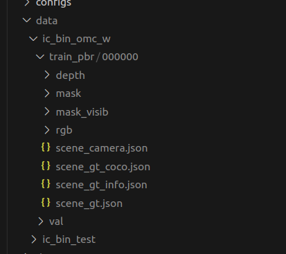

Step 1. Follow the installation guide to mmDetect from their website. 

[mmDetect Installation Guide](https://mmdetection.readthedocs.io/en/latest/get_started.html)

Step 2. Put your dataset within the data folder. I have named my dataset ic_bin_omc_w.



Step 3. Train a machine learning model with the following command:

``` bash
python tools/train configs/blenderbin/instaboost.py
```

step 4. Test and format to json format. 

open demo/test_coco_format.ipynb and run the script to perform inference and save the results as a json file that can be used in the bop_toolkit to get the test score. 